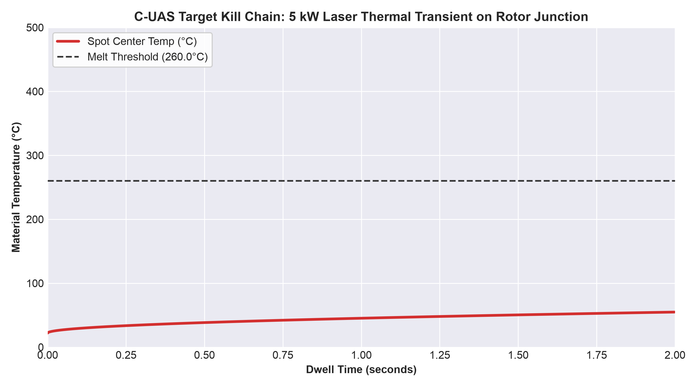

# Killswitch

**A Software-Defined Directed Energy (SDDE) Counter-UAS node.**
Singapore Defence Tech Hackathon

> We are not building a cheaper laser. We are making the aiming intelligence
> portable — so the next thousand interceptor nodes cost what the hardware
> costs, not what the vendor charges.

---

## The Problem

A US$500 drone gets intercepted by a US$100,000 missile or a US$1.5M turret. That is an
exchange ratio no nation wins, and a salvo of fifty simply routes around the three nodes
you could afford to buy.

Directed energy fixes the economics — but today's systems ship as closed, vertically
integrated hardware. **The binding constraint is not beam power. It is cost-per-node and
vendor lock-in.**

Killswitch is the **targeting brain, not the turret**: an open, hardware-agnostic layer
that finds, tracks, predicts and holds a beam on a manoeuvring drone, running today on a
webcam, an ESP32 and a US$200 gimbal — and designed to re-host onto a military beam
director without a rewrite.

---

## Architecture

```
┌──────────────────────────────────────────┐
│   TARGETING BRAIN  (portable, the IP)    │
│   detect → track → predict → aim → gate  │
└──────────────────────────────────────────┘
        │              │              │
  FrameSource    ActuatorDriver   C2 Client
        │              │              │
  USB camera      ESP32 + SG90      MQTT
  (or MWIR)       (or beam dir.)   (radar cue + operator auth)
```

**Host (Python):** OpenCV capture with stale-frame rejection → YOLOv11 + ByteTrack →
aimpoint solver → velocity estimator → control law → serial.

**Edge actuator (ESP32-S3, C++):** command parser → checksum → bounds clamp → servo PWM →
effector gate, plus a deadman timer and burn ceiling **the host cannot override**.

### Engagement state machine

```
IDLE ──cue──▶ SCAN ──detect──▶ TRACK ──error≤15px──▶ HOLD
                                                      │ 3.0s continuous
                                                      ▼
  IDLE ◀──burn complete / fault── ENGAGE ◀──SPACE── OPERATOR_AUTH
```

`ENGAGE` has **exactly one predecessor**. There is no path to the effector that does not
pass through a human.

---

## Why This Architecture Wins

**1. The firmware is the safety authority, not the host.**
Python can stall on the GIL, pause for GC, be descheduled, or crash. None of that can
extend a burn, because none of the safety decisions live there. The ESP32 independently
enforces a 250 ms deadman (**measured 254 ms**) and a 2.0 s burn ceiling (**measured
2002 ms**). Pull the USB cable mid-burn and the effector dies in a quarter second without
the host participating.

**2. Asymmetric integrity on the wire.**
Commands that *increase* hazard carry an XOR checksum — `M1*7C` arm, `L1*7D` fire.
Commands that *decrease* hazard carry none and are accepted unconditionally. A corrupted
byte can never fire the effector; a corrupted byte can never block a shutdown. Combined
with two-key arming, energising requires **two independently checksum-valid commands in
order**.

**3. Hardware agnosticism, demonstrated rather than asserted.**
Every abstract interface has at least two live implementations, and **all 136 tests run
with no camera, no ESP32, no broker and no model weights.** Swapping the bench gimbal for
a beam director is a driver change.

**4. The human gate is structural, not cosmetic.**
`OPERATOR_AUTH` is a state in the transition table, not a callback someone can forget to
await. Authorisation binds to `target_id` and consumes a single-use nonce — auth for
track 7 cannot fire on track 9, and a replayed message is rejected.

**5. Everything is measured.**
`LatencyTracker` samples real glass-to-command intervals and feeds the lead time. The
closed-loop simulator proved the shipped gain (`Kp=0.6`) is stable and that `Kp≥0.8` goes
under-damped. Every number in the pitch traces to a log file.

---
## Target Effects & Thermal Kill Chain

The `Killswitch` software architecture enforces a strict 3.0-second continuous track (`HOLD` state) before operator authorization is requested. This temporal gate is mathematically derived against standard commercial C-UAS polycarbonates to guarantee structural failure.



**Simulation Parameters:**
* **Optical Load:** 5 kW at 1.55 µm (Atmospheric Attenuation: $\gamma = 0.0008$)
* **Engagement Range:** 350 meters
* **Boresight Jitter:** 0.282° (4.9 mrad)
* **Target Material:** Polycarbonate / Nylon 6,6 ($T_{melt} = 260^\circ\text{C}$)

Accounting for beam divergence and 1D Fourier heat conduction, continuous track maintenance initiates material phase change (melting) at **1.11 seconds**. The 3.0-second software gate ensures a >2x safety margin for complete rotor junction failure before the system disengages.

## Hardware

| Role | Part |
|---|---|
| Host | Laptop/PC (Windows demo box, macOS dev) |
| Actuator | ESP32-S3-N16R8 — 16 MB flash, 8 MB PSRAM, CH343 USB-UART bridge |
| Gimbal | 2× SG90 micro servo, pan/tilt |
| Camera | USB UVC webcam on the **host** — **not** wired to the ESP32 |
| Effector | KY-008 650 nm laser module, low-side switched through a 2N2222 |

> **The camera is a host device by design.** An OV5640 on the ESP32-S3 collides with the
> actuator GPIOs, cannot stream over a 921600-baud UART (~1 fps for 720p MJPEG), and puts
> camera DMA on the processor that owns the 250 ms deadman. See `CLAUDE.md` for the full
> reasoning. `helper/vision/frame_source.py` opens a UVC device by index and has no path
> to a DVP/MIPI sensor.

### Wiring

| Function | GPIO | Notes |
|---|---|---|
| Servo PAN | 5 | Separate 5 V rail |
| Servo TILT | 6 | Separate 5 V rail |
| Effector gate | 7 | 1 kΩ → 2N2222 base; collector sinks KY-008 `−`; **10 kΩ pulldown to GND** |

**Two wiring rules that are not optional:**

**Servos get their own 5 V supply, with common ground to the ESP32.** Two SG90s stall-draw
~700 mA each. On a shared rail they brown out the board under load — i.e. during tracking,
i.e. on stage.

**The 10 kΩ pulldown on GPIO 7 is mandatory.** Between power-on and the first line of
`setup()`, every ESP32 GPIO is a floating input. A floating gate is an undefined effector
state through boot, reflash, brownout and crash. Software cannot fix this. The resistor can.

Use the **CH343 UART bridge** port, not native USB-CDC: the bridge stays enumerated across
ESP32 resets, so your serial handle survives. On Windows the bridge shows as
`USB-Enhanced-SERIAL CH343 (COMn)`; the native port shows as `USB Serial Device (COMn)`.
Auto-detect matches the first and deliberately refuses the second.

**Power is rail-separated, not galvanically isolated.** The ESP32's 5 V/VIN is left
unconnected and the servo rail is fed from a second USB-C supply, which keeps servo sag
off the logic rail. The grounds are still common — through the GND jumper the PWM signals
need, and through the host chassis. Say *rail separation* when describing it.

---

## Quickstart

```bash
python -m venv .venv && source .venv/bin/activate
pip install -r requirements.txt
```

**1. Bring up the camera** — measures real fps per mode and whether `CAP_PROP_BUFFERSIZE`
is honoured on your machine:

```bash
python -m tools.camera_probe
```

**2. Flash and verify the actuator.** Open `firmware/esp32_actuator/esp32_actuator.ino`
(board: *ESP32S3 Dev Module*, library: *ESP32Servo*), flash, then:

```bash
python -m tools.serial_probe --list
python -m tools.serial_probe --port /dev/ttyUSB0
```

This walks boot state → gimbal motion → bounds clamping → arming interlock → effector →
burn ceiling → deadman, printing pass/fail per check.

**3. Prove the control loop converges** — no hardware needed:

```bash
python -m tools.simulator
```

**4. Start the broker.** Platform-specific — `systemctl` does not exist on macOS:

```bash
brew install mosquitto && brew services start mosquitto
```

```bash
sudo apt install -y mosquitto && sudo systemctl start mosquitto
```

**5. Run the node.** Subsystems mock independently, because they fail
independently — a dev machine commonly has a camera and model but no ESP32 and no broker:

```bash
python main.py --config config/bench.yaml
```

| Flag | Use when |
|---|---|
| *(none)* | Everything attached |
| `--mock-actuator` | No ESP32 plugged in |
| `--mock-c2` | No MQTT broker running |
| `--mock-camera` | No camera, or permission not granted |
| `--mock-detector` | No weights present |
| `--mock` | All of the above — pure logic run |

Real camera and real model on a laptop with no hardware and no broker:

```bash
python main.py --config config/bench.yaml --mock-actuator --mock-c2
```

**6. Run the operator console** (separate terminal — this is the demo screen):

```bash
python -m tools.operator_console
```

`SPACE` authorise · `D` deny · `C` send a test cue · `Q` quit

**Tests:**

```bash
pytest tests/ -q        # 136 tests, zero hardware, ~0.1s
```

---

## Platform Notes (macOS)

**Camera permission.** macOS gates camera access per-application. If
`tools.camera_probe` prints `not authorized to capture video`, grant access to your
*terminal* app under **System Settings → Privacy & Security → Camera**, then **fully quit
and reopen the terminal** — the permission is read at process start, so a running shell
will not pick it up.

**Serial port naming.** macOS does not use `/dev/ttyUSB0`. With a CP2102 bridge the port
is `/dev/cu.usbserial-XXXX`; with a CH340 it is `/dev/cu.wchusbserial-XXXX`. Always
confirm before editing `config/bench.yaml`:

```bash
python -m tools.serial_probe --list
```

If nothing but `Bluetooth-Incoming-Port` and `debug-console` appears, the board is not
enumerating — check the cable carries data (not charge-only), that the board is powered,
and that the CP2102/CH340 driver is installed.

**`systemctl` does not exist on macOS.** Use `brew services` as above.

---

## Platform Notes (Windows)

**Python 3.11 minimum, 3.14 validated.** `tools/c2_bridge.py` uses `asyncio.TaskGroup`
and PEP 654 `except*`; below 3.11 it fails as a `SyntaxError` at import, before any log
line. Everything else in the repo is 3.9-compatible. Check with `python -V`.

**The bridge forces a selector event loop.** Windows has defaulted to
`ProactorEventLoop` since 3.8, and Proactor does not implement `add_reader`, which
aiomqtt needs to drive paho — the symptom is `NotImplementedError` on startup.
`_run_bridge()` handles this. It prefers `asyncio.run(loop_factory=...)` on 3.12+ because
3.14 deprecates `set_event_loop_policy` and the `*EventLoopPolicy` classes, with removal
targeted for 3.16; the policy call is kept only for 3.11.

**Serial port.** The ESP32-S3-N16R8 uses a CH343 bridge, reported as
`USB-Enhanced-SERIAL CH343 (COMn)`. Confirm the number before every demo — it moves when
the board changes physical socket:

```bat
python -m tools.serial_probe --list
```

`config/fallback.yaml` pins `actuator.port: "COM3"`. Auto-detect also matches the CH343
family now, so `"auto"` works; the pin just removes discovery from the critical path.
**Never select the port named `USB Serial Device`** — that is the S3's native USB-CDC,
which re-enumerates on every board reset and kills the host's serial handle mid-run.

### Hardware verification log

**Actuator path — COMPLETE.** `python -m tools.serial_probe --port COM3` passes
**13/13** on the Windows rig: CH343 bridge at 921600 baud with clean `ActuatorStatus`
framing, effector de-energised and disarmed at boot, out-of-range commands clamped to
pan 180 / tilt 45, fire refused while disarmed, arming accepted, effector energised only
once armed and de-energised on command, firmware burn ceiling cut without host
involvement, and the 250 ms deadman cutting the effector *and* dropping arming.
Positioning confirmed separately via `--interactive` (`a <pan> <tilt>`).

> The two bounds checks read **commanded** angles from the status frame — SG90s have no
> position feedback, and `run_checks()` notes that its gimbal section "passes even with no
> servos attached." 13/13 proves the firmware clamps correctly. Physical travel to the
> stops is confirmed by watching the gimbal, not by the pass count. Do not quote the clamp
> result as measured travel.

**Still outstanding before the stack is integration-ready:**

| Gap | Why it matters |
|---|---|
| Vision pipeline untested on the rig | YOLO lock against a real target through the host webcam |
| C2 plane untested end to end | Bridge, dashboard, and one clean `SPACE` → `ENGAGE` → `ENGAGEMENT COMPLETE` |

> ⚠️ `serial_probe --port COM3` **fires the effector** — a KY-008 laser, not the LED the
> console prints still describe. Two ~0.5 s pulses, a 2.6 s burn-ceiling test, then a
> deadman test. Matte backstop, area behind it clear, every time.

**If the engine dies with `No status from firmware on COM3 within ...`.** Opening the
port asserts DTR, which resets the ESP32; the driver waits out that boot before it expects
a status frame. The S3-N16R8 boots slower than the WROOM-1 the original budget was tuned
on, so the budget is now `boot_settle_s: 2.0` + `connect_timeout_s: 6.0` in the
`actuator:` block of each config. Raise `connect_timeout_s` if it still trips.

**Do not suppress the DTR reset to "fix" this.** The reset is what makes *connected* mean
*known state* — without it the host attaches to a board in whatever condition the last run
left it — and it is what triggers the `OK BOOT ... pan_ch=N tilt_ch=N` banner, the only
report of a PWM attach failure that is otherwise completely silent. A slow boot needs a
longer wait, not a suppressed reset.

Every successful connect now logs its measured bring-up against the budget, and warns
above 75% of it. Watch that number: a first status landing near the budget is the warning
that the next connect may not.

**Mosquitto runs as a service.** Confirm before launching anything:

```powershell
Get-Service -Name mosquitto
```

If it reads `Stopped`, `Start-Service mosquitto`. Running as a service means you lose the
`-v` broker log; to watch the wire during debugging, stop the service and run
`"C:\Program Files\mosquitto\mosquitto.exe" -v` in a terminal instead.

### ATAK-CIV on a phone

The bridge's CoT reaches an unmodified ATAK-CIV phone. The map is **output-only**: a
marker dropped in ATAK does not move the gimbal, and nothing on the map is set by hand.

**Install.** *ATAK-CIV (Civil Use)*, package `com.atakmap.app.civ`, free on Google Play,
Android 5.0+. If it isn't listed in your region, get the APK from tak.gov (no login needed
for the app itself), not from an APK mirror site.

**Network.** Put the phone and laptop on the same Wi-Fi, or put the laptop on the
phone's own hotspot, which takes the venue's access point out of the path. Many phone
hotspots and access points drop multicast but still pass unicast, so send the phone a
direct copy as well:

```bat
python -m tools.c2_bridge --threat-start-m 420 --cot-unicast <phone-ip>
```

On the phone's hotspot, the phone's IP is the laptop's **Default Gateway** in `ipconfig`.
The bridge's first line then reads `CoT -> 239.2.3.1:6969 + unicast <phone-ip>:6969`.
`--cot-unicast` repeats, so a judge's phone can be added alongside yours.

**ATAK input.** *Settings → Network Preferences → Network Connection Preferences → Manage
Inputs*: make sure a UDP input on `239.2.3.1:6969` exists and is enabled. It usually does
by default. If unicast still shows nothing, add a UDP input on port 6969.

**Before the venue:**
- **Cache the map.** Pan and zoom around NUS Kent Ridge while you have internet, or the
  tracks sit on a blank grid.
- **Check the clocks.** ATAK drops a track whose stale time has already passed on the
  phone. Threats are only valid for 4 s, so a phone clock a few seconds ahead makes them
  vanish on arrival. If they do, add `--stale-pad-s 5` (up to 60).
- **Keep the phone awake**, and turn off battery optimisation for ATAK. Android drops
  multicast while the Wi-Fi radio sleeps.
- **Smoke-test first:** `python -m tools.multicast_test --send --seconds 60` should put a
  `MULTICAST-TEST` marker at NUS on the phone.

**What the map shows.** All positions are relative to `--base` (default NUS Kent Ridge,
`1.2966,103.7764`):

| Marker | Label and remarks |
|---|---|
| Node 1 (real) | `KILLSWITCH-01 [<state>]`, remarks `REAL NODE \| STATE … \| TGT …`. Follows the real node: pressing SPACE in the console turns it to `[ENGAGE]`. Reads `[NO LINK]` before the node reports, as soon as its MQTT last-will fires, or after 10 s of silence. |
| Nodes 2–20 | Remarks `SIMULATED INTERCEPTOR` / `RF-JAMMER` / `SENTRY-UGV` / `LASER` |
| Threats | Red UAV icons, remarks `SIMULATED THREAT \| <range> m \| TTI <s> s` |

The map refreshes at 2 Hz, so a state shorter than half a second (SCAN usually is) may
not appear on it. The dashboard updates at 5 Hz.

---

## Demo Runbook — Windows, 4 terminals

**Pre-requisite.** Mosquitto runs as a Windows service, so it needs no terminal:

```powershell
Get-Service -Name mosquitto      # must read Running; else Start-Service mosquitto
```

Launch order does not matter — the dashboard reconnects with capped backoff — but this
order gives the cleanest console output. Start **Terminal D last**: see the timing note.

```bat
:: Terminal A — dashboard   (then open http://localhost:8000/c2_dashboard.html)
python -m http.server 8000 -d tools

:: Terminal B — engine
python main.py --config config/fallback.yaml

:: Terminal C — operator console   (must hold window focus to receive keystrokes)
python -m tools.operator_console --config config/fallback.yaml

:: Terminal D — threat generator
python -m tools.c2_bridge --threat-start-m 420
```

**Health checks, in order:**

| Terminal | Proof it is healthy |
|---|---|
| B | `C2 connected to localhost:1883 as killswitch-01`, then a resolved serial port |
| D | all three of `CoT -> …`, `MQTT connected …`, `WebSocket serving on ws://localhost:8765` |
| A | header flips `CONNECTING` → `CONNECTED`; gimbal badge reads green **`PHYSICAL GIMBAL`** |
| A | `DEADMAN AGE` shows a live value under 0.250 s; `FIRMWARE UPTIME` climbs |

A cyan **`LOOPBACK SIM`** badge means the engine is running `--mock-actuator`. On a HITL
run that is a wiring or port fault, not a display quirk.

### Trigger chain rehearsal

1. Four threat tracks appear on the radar with bearings **45, 55, 315, 180**, amber.
2. At **t ≈ 1.67 s** BETA-01 crosses the 350 m perimeter; its row turns red and the
   gimbal slews to **pan 45°** to intercept it.
3. Present the vision target — COCO classes `bird` / `airplane` / `kite` / `frisbee`
   (`config/fallback.yaml`). Watch `SCAN → TRACK`.
4. Hold it steady. The **HOLD PROGRESS** bar fills over 3.0 s, then the state pill turns
   amber and blinks: **`OPERATOR_AUTH`**. You have 10 s.
5. **Focus Terminal C and press `SPACE` at t ≈ 10.0–10.5 s** (see below for why the
   timing matters). C logs `AUTHORISED TRK-…`; B logs
   `operator AUTHORISED …` and `OPERATOR_AUTH → ENGAGE`; the dashboard `ARMED / EFFECTOR`
   cell reads **`FIRING`**. The laser burns for 1.8 s, then `ENGAGEMENT COMPLETE`.
6. **The fail-safe demo:** during a burn, pull the USB cable. The laser dies within
   250 ms because the firmware, not the host, is holding it on.

**Timing note.** `--threat-start-m 420` only buys one fast cycle. All four threats
resolve by **t ≈ 13.7 s**, after which the scenario resets to ~1210 m and the next breach
is ~20 s out. Restart Terminal D immediately before you present.

**GAMMA-01 (bearing 180°) takes priority at t ≈ 11.9 s** — 11.71 s on paper, later in
practice because the bridge ticks at 10 Hz. It sits outside the 180° pan arc, so
`cue_to_gimbal()` returns `None` and the node publishes `cue_rejected` without moving.
Azimuth is rejected; elevation is clamped. That asymmetry is deliberate and is worth
narrating rather than hiding.

**The rejection only shows if the node is in IDLE at that moment.** The node reads cues
only in IDLE and OPERATOR_AUTH, and only IDLE rejects them out loud; SCAN, TRACK, HOLD and
ENGAGE ignore cues entirely. So time `SPACE` so the 1.8 s burn ends inside GAMMA's window.
Measured on the full stack (`--sim-target`, `fallback.yaml`), one run per press time:

| `SPACE` at | GAMMA rejections logged | Time to narrate |
|---|---|---|
| 9.9 s | 9 | ~1.8 s |
| **10.5 s** | **7** | **~1.4 s** |
| 11.5 s | 2 | ~0.4 s |

Aim for 10.0–10.5 s. Missed it? Press `D` while the pill reads `OPERATOR_AUTH` between
11.9 and 13.7 s; the node drops to IDLE and the rejections follow. Press `D` only in
OPERATOR_AUTH — from any other state it queues.

### Hardware-free fallback: `--sim-target`

If the ESP32, the camera, or the vision lock fails on the day, the whole trigger chain
still runs with no hardware at all. Relaunch **only Terminal B**:

```bat
python main.py --config config/fallback.yaml --sim-target
```

Terminals A, C and D stay exactly as they are. What changes:

- The camera and detector are replaced by `tools/simulator.py::SceneDetector`, a
  synthetic target placed where BETA-01's cue points the gimbal (pan 45°). It uses the
  same closed-loop scene model as the convergence proof: its pixel position depends on
  where the gimbal points, so the node's real control law has to earn the lock.
- **The mock actuator is forced, and nothing can override it.** A synthetic target
  satisfies the visual-lock condition with nothing real in the beam path; driving the real
  laser from it would fire at whatever the gimbal faces. `SceneDetector` raises
  `TypeError` if handed anything but `MockActuator`.
- MQTT stays real, so the bridge, console and dashboard connect as normal. The dashboard
  badge reads cyan **`LOOPBACK SIM`**. Say so out loud; a judge who spots it unprompted
  will assume you hid it.
- B's first line reads `actuator=MOCK camera=SIM detector=SIM c2=real`.

Verified end to end on a broker + engine + bridge run: `SCAN → TRACK → HOLD` (3.01 s) →
`OPERATOR_AUTH` → `operator AUTHORISED TRK-BETA_01` → `burn complete at 1.81s`, peak
error 1.12 px, then GAMMA-01 rejected in IDLE with the gimbal still.

Expect `HOLD` and `TRACK` to alternate a few times in the first second or two while the
loop settles — HOLD resets on any excursion from the 15 px band, by design.

Every state transition, firing solution and engagement is written to
`logs/<node>-<timestamp>.jsonl` as well as published over MQTT — so the audit trail
survives a broker outage.

---

## Documentation

| File | |
|---|---|
| [architecture.md](architecture.md) | Topology, concurrency model, state machine, latency budget, known limits |
| [guardrails.md](guardrails.md) | Binding safety constraints — read before touching the effector path |
| [CLAUDE.md](CLAUDE.md) | Conventions and context for AI-assisted development |

---

## Honest Limits

Stated here so nobody has to discover them.

- **Open-loop actuator.** SG90s have no position feedback. Reported angles are
  *commanded*, never measured. The loop closes optically, through the camera.
- **Monocular — no range.** Bearing-only. No time-to-target, no slant range.
- **Aimpoint offset is geometric, not semantic.** It biases within a detected box. It does
  not identify a rotor hub — a trained keypoint model behind the same interface would.
  Below `min_box_px` the solver reverts to centre-of-mass and says so in the audit log.
- **180° pan arc.** Cues outside ±90° of boresight are rejected, not serviced.
- **Visible spectrum only.** No night, no degraded visibility, no hit-spot verification.
- **The effector is an LED.** Every firmware guardrail is sized for a hazardous effector
  because the architecture claims this brain re-hosts onto one.
- **MQTT is unauthenticated at transport in the demo config.** Payload validation and auth
  tokens are application-layer. Production requires mTLS.
